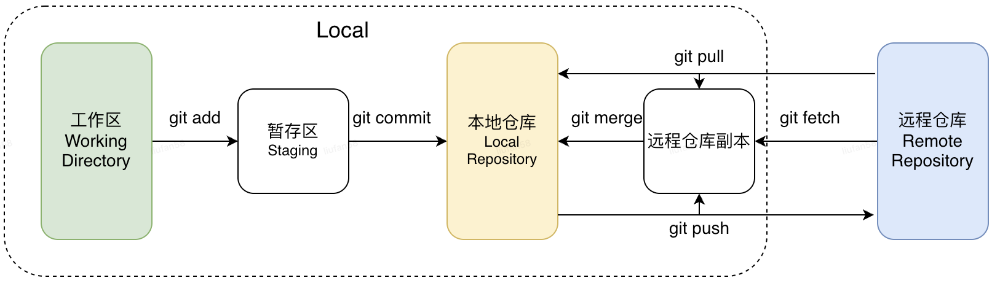
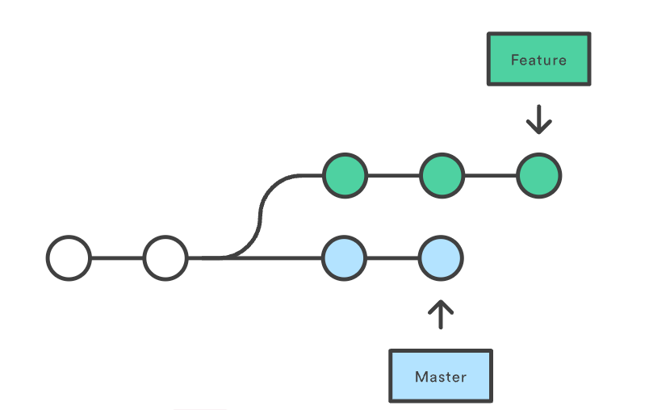
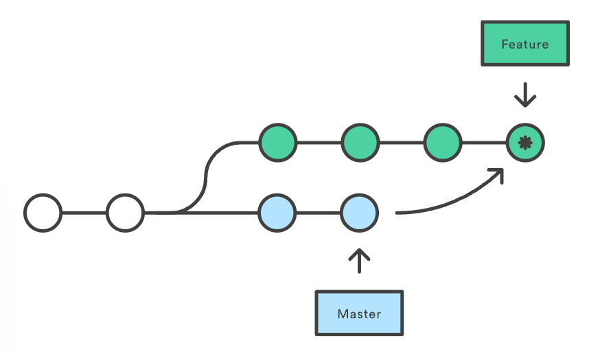
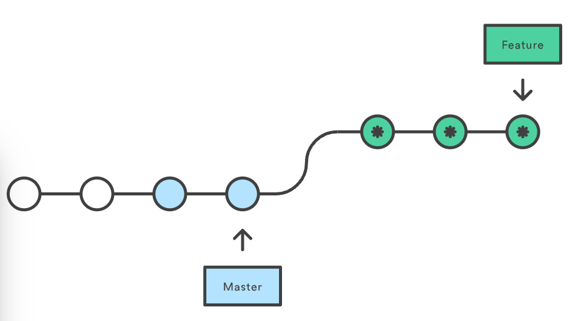

# git开发全搞定

## 1.git源码及最新发布版本
https://github.com/git/  
https://mirrors.edge.kernel.org/pub/software/scm/git/


## 2.初始设置

### 2.1 设置用户名、邮箱等基础信息

git提供了专门用来配置或读取环境变量的工具git config，这些环境变量主要保存于以下三个地方：

- /etc/gitconfig，对系统中所有用户都适用的配置，对应参数为 --system
- ～/.gitconfig，位于用户目录下的配置文件，只适用于当前用户，对应参数为 --global
- .git/config，当前项目git目录中的配置文件，为默认的配置文件。

> 每一个级别的配置都会覆盖上层的相同配置。比如.git/config里的配置会覆盖/etc/gitconfig中的同名变量。

```bash
git config --global user.name "liufan"
git config --global user.email "1649750212@qq.com"

# 查看配置信息
git config user.name # 查看某个环境变量的设定
git config --lis # 查看全局配置信息
git config --list # 查看当前项目的配置信息

# 编辑配置信息
git config -e # 针对当前仓库
git config -e --global # 针对全局配置

# 设置文本编辑器，默认是vi或vim，也可以设置其他
git config --global core.editor emacs

# 设置差异分析工具，git可以理解kdiff3，tkdiff，meld，xxdiff，emerge，vimdiff，gvimdiff，ecmerge，和 opendiff 等合并工具的输出信息。
git config --global merge.tool vimdiff
```

### 2.2 设置ssh

1. step1:在本地生成公钥和私钥

```bash
# -t后接加密算法
ssh-keygen -t rsa -C "1649750212@qq.com"
```

> 本地会在～/.ssh，目录下生成id_rsa.pub公钥文件和id_rsa私钥文件

```bash
# 查看公钥内容
cat ~/.ssh/id_rsa.pub
```

2. step2:将公钥添加到git远程服务器
```bash
# 本地测试是否添加成功
ssh -T git@github.com
```

## 3.git工作区域及常用命令



### 3.1git创建仓库
```bash
# 在本地初始化一个git仓库
git init
git init <directory>

# 从远程仓库拷贝项目
git clone <repo> # 拷贝到当前目录
git clone <repo> <directory> # 拷贝到指定目录
```

### 3.2git本地提交操作
```bash
# git add 将文件添加到暂存区
git add . # 添加所有文件
git add *.c # 添加所有c文件
git add [file1] [file2] [dir] # 添加多个文件或目录

# git commit 将暂存区内容提交到本地仓库
git commit -m [message]
git commit [file1] [file2] ... -m [message] # 提交暂存区的指定文件到本地仓库
git commit -a # 修改文件后直接提交到仓库
git commit -am [message]
git commit --amend -m [message] # 合并此次提交到上一次提交

# git rm 删除文件
git rm [file] # 从工作区和暂存区删除file
git rm -f [file] # 强制删除暂存区中修改过的file
git rm --cached [file] # 只删除暂存区中的文件，而不删除工作区中的文件
git rm -r * # 递归删除目录下所有文件

git mv # 重命名或移动文件

# git reset 回退版本
# --soft：只修改本地库的指针，工作区和暂存区不变，即reset之后的版本处于未提交状态
# --mixed：修改本地库指针，重置暂存区内容，即reset之后版本处于未unstaegd状态 （默认）
# --hard：修改本地库指针，重置工作区和暂存区内容，即reset之后内容全部消失
# --keep：修改本地库指针，暂存区不变，重置工作区，即本地代码为回退后的版本，而暂存区不变。
git reset [--soft | --mixed | --hard | --keep] [HEAD]
git reset HEAD^ [file] # 回退file的内容到上一版本
git reset 052e # 回退到指定版本
git reset HEAD~3 #回退到前三个版本
git reset HEAD # 取消已commit的内容到unstaed状态

# git restore 恢复或撤销文件更改
git restore <file> # 将file恢复到最新提交状态，舍弃所有未提交的更改
git restore --staged <file> # 撤销git add操作，重置stage区域
git restore --source=<commit> <file> # 将文件恢复到特定提交<commit>的状态
git restore . # 还原所有未提交的更改

# git stash 隐藏未提交的更改
git stash # 将更改保存在堆栈中
git stash list # 查看堆栈中隐藏的更改
git stash pop # 从堆栈中删除更改，并放置到当前工作目录中
```

### 3.3git日志及状态操作
```bash
# git status查看git仓库当前状态
git status
git status -s # 查看文件状态

# git diff 比较文件不同
git diff [file] # 显示暂存区和工作区的差异
git diff --cached [file] 
git diff --staged [file] # 显示暂存区和上一次commit的差异

git log # 查看历史提交记录  
git blame <file># 以列表形式查看指定文件的历史修改记录
参考链接：https://www.runoob.com/git/git-commit-history.html#git-log
```

### 3.4git分支操作
```bash
# git branch 分支操作
git branch # 查看所有本地分支
git branch <branch_name> # 创建一个本地新分支
git branch -d <branch_name> # 删除一个分支

# git checkout 切换分支
# Git 2.23版本之后，可以使用git switch来进行分支切换
git checkout <branch-name> # 切换到指定分支
git checkout -b <new-branch> # 创建一个新的分期，并切换到新创建的分期
git checkout - # 切换到前一个分支
git checkout -- <file> # 将file恢复到最新的提交状态，丢弃所有未提交的更改
git checkout <commit-hash> # 查看指定提交版本的历史记录，而不能进行分支操作

# git merge 分支合并
git merge <branch> # 将指定分支合并到当前分支

# git rebase 变基
git rebase <branch_name> # 将本地当前分支的修改变基到另一分支上
# 在rebase过程中，可能会出现冲突，git会停止rebase，并让你去解决冲突，解决完冲突后，首先使用`git add`更新索引，然后使用continue继续rebase或者abort来终止。
git rebase --abort | --continue 
```

### 3.5git本地与远程交互操作
```bash
#  git fetch 拉取
git fetch [alias] #拉取远程仓库更新的数据
git merge [alias]/[branch] # 上述命令执行完成后，将更新的数据合并到本地当前分支

# git pull 拉取
git pull # git fetch + git merge FETCH_HEAD
git pull <远程主机名> <远程分支名>:<本地分支名> # 从远程拉取指定分支，并合并到本地分支，省略本地分支，即合并到当前分支。

# 远程分支关联，执行git pull、git push操作时， 不需要指定远程分支。
git branch --set-upstream-to=origin/remote_branch  your_branch

# git remote 管理Git仓库中的远程仓库
git remote # 列出当前仓库中已配置的远程仓库
git remote -v # 列出当前仓库中已配置的远程仓库，并显示它们的url
git remote add <remote_name> <remote_url> #添加一个新的远程仓库，指定名称和url，并将其添加到当前仓库中

# git push 推送
git push <远程主机名> <branch>:<remote_branch> #将本地分支版本上传到远程并合并
git push --force origin master #如果本地与远程有差异，强制推送
```

## 4.常见问题
### 4.1git rebase和git merge的区别

#### 合并前
在使用git工具进行合作开发时，我们首先需要基于master分支创建一个个人开发分支feature。当我们在feature分支上开发了新功能时，另一位团队成员更新了master分支的内容，这会产生一个分叉的提交历史，如图所示。


#### 使用merge
```bash
git merge master
git merge feature master
```
在feature分支创建一个合并提交，如图所示。


#### 使用rebase
```bash
git checkout feature
git rebase master
```
将feature分支的提交历史rebase到master分支的提交历史顶端。rebase操作会为原始分支的每次提交创建全新的提交，并重写原始分支的提交历史。

- 优势：使用rebase的**好处**是可以让项目提交历史变得干净整洁，其会产生一个线性的项目提交历史。
- 缺点：rebase操作会导致丢失合并提交能够提供的上下文信息——我们无法知晓功能分支何时应用了上游分支的变更。


#### 使用场景
- 使用rebase的场景
  - 个人开发分支，同步公共分支的修改，不希望丢失个人开发分支的提交。
- 使用merge的场景
  - 将个人开发分支的内容合并到主分支

参考链接：https://zhuanlan.zhihu.com/p/493953965