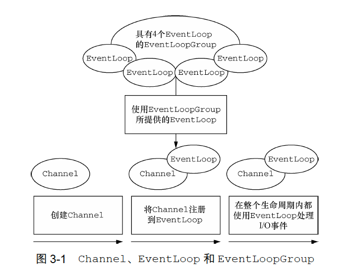
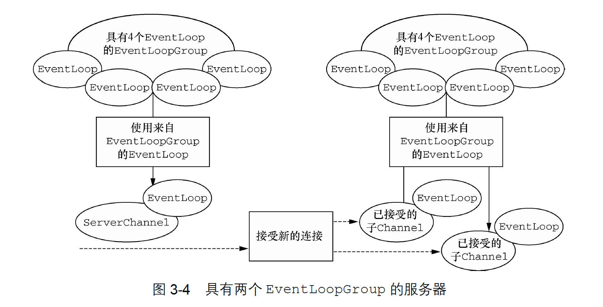

# Netty学习笔记-1

## Chapter3: Netty核心抽象
### Channel, EventLoop, ChannelFuture

- channel: 提供IO操作方法

- EventLoop: 处理连接的生命周期中所发生的事件
  * 一个EventLoop在其生命周期内只和一个Thread绑定；
  * 一个Channel在其生命周期内只注册一个EventLoop；
  * 一个EventLoop可以分配给多个Channel。

- ChannelFuture: 类似Future，对异步操作结果进行建模。其addListener()方法注册了
ChannelFutureListener，可以在某个操作完成时获取通知。

### ChannelHandler, ChannelPipeline

- ChannelHandler: 充当所有处理出入站数据逻辑的容器。
  * ChannelInboundHandler: 从Socket中读数据；
  * ChannelOutboundHandler: 向Socket中写数据。
- ChannelPipeline: 提供ChannelHandler链的容器，并定义了用于在该链上传播入站和出站事件流的API。
- ChannelHandler和ChannelPipeline通过ChannelHandlerContext链接，该对象为Netty中数据流转的抽象。

### 引导类
Netty引导类为应用程序的网络层配置提供了容器。

- ServerBootstrap: 服务器，将一个进程绑定到某个指定的端口；
  * 服务器需要两个EventLoopGroup，对应两组不同的Channel。第一组只包含一个ServerChannel，代表服务器
自身的正在监听的套接字，第二组包含所有已经创建的用来处理传入客户端连接的Channel，每个已接收的连接都有一个。

- Bootstrap: 客户端，将一个进程连接到另一个运行在某个指定主机的指定端口上的进程。

