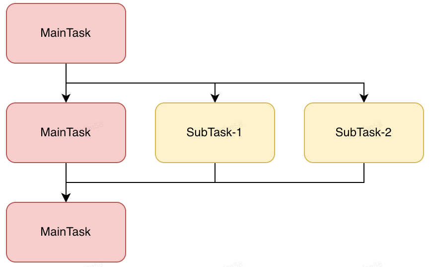

# java8并发任务编排利器-CompletableFuture

## 背景
我们通常会使用多线程来提高IO密集型任务的执行效率，以充分发挥计算机的性能。 对此，Java提供了Thread类
和Runnable接口，开发人员可以通过继承Thread类或实现Runnable接口，再调用`start()`方法开启一个子线程。
这两种方法存在一个缺陷，开发人员在主线程创建并执行一个子线程之后，就失去了对子线程的控制，也无法优雅地获取
线程执行结果。

> 在Java中可以通过共享变量获取子线程执行结果，但存在以下缺陷：
> 
> **1.线程安全问题**：共享变量在多线程环境下可能存在竞态条件和数据不一致的问题。如果多个线程同时访问和修改共享变量，
> 可能导致意外的结果或者不确定的行为。使用`volatile`关键字修饰共享变量可以确保可见行，但无法解决原子性和有序性问题。
> 
> **2.缺乏通知机制**：通过共享变量获取子线程执行结果通常需要使用轮询的方法检查变量的状态，这会造成CPU资源浪费。
> 同时，轮询间隔时间难以确定，可能导致延迟获取结果。
> 
> **3.难以处理异常**：如果子线程发生异常，通过共享变量的方式难以及时捕获和处理异常。

Java1.5引入Callable和Future接口，用于获取子线程执行结果。Future用来表示异步计算的结果，可以通过阻塞或者
轮询的方式获取结果，但不支持回调，对于更加复杂的场景，比如并发任务之间存在依赖关系，下游任务需要依赖上游任务的
执行结果，此时，使用Callable+FutureTask的组合编程会十分臃肿。

>Future接口在Java5中被引入，设计初衷是对将来某个时刻会产生的结果进行建模。它建模了一种异步运算，
> 返回一个执行结果的引用，当运算结束后，这个引用被返回给调用方。在Future中触发那些潜在耗时的操作完成。《Java8实战》

[Java中的Future机制]:https://zhuanlan.zhihu.com/p/54459770

由此，Java1.8引入了CompletableFuture，对Future的功能进行了扩展，其提供了丰富的api，方便开发人员对复杂并发任务
进行编排，简化开发流程。

## 使用场景

- 多任务并发执行：即多个相互之间没有关联的IO密集型任务，可以通过并发执行提高系统效率。Completable可以获取各个
subTask的执行结果，并对结果进行整合。

- 
- 

## api及用法

## 原理

## 总结

## 参考链接